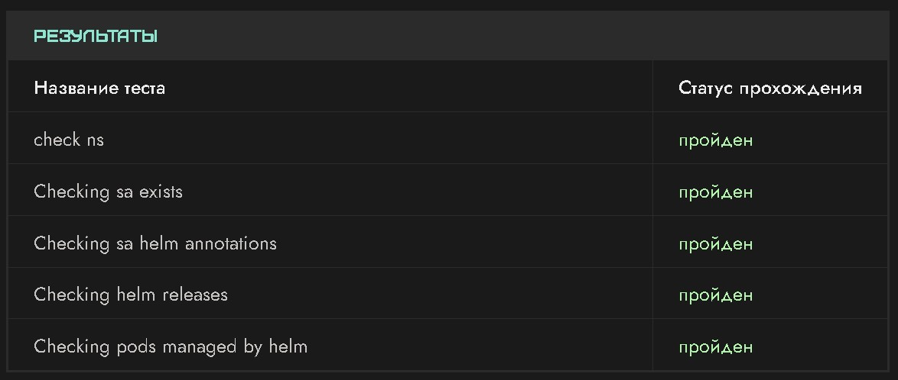

# Практическое задание
## Описание
* Создайте чарт с именем myhelmchart.
* Добавьте возможность менять имя сервис-аккаунта (помните, что помимо самой сущности sa, он также прописывается в deployment) и задайте ему имя helm-sa.
* Задеплойте чарт в неймспейс helm с именем myhelmchart.

## Создание
```bash
helm create myhelmchart
```

## Установка
Для того, чтобы изменить имя сервисного аккаунта, нам необходимо или создать свой values.yaml со следующим содержимом
```yaml
serviceAccount:
  name: "helm-sa"
```
И установить chart следующей командой
```bash
helm upgrade --install --create-namespace -f values.yaml -n helm myhelmchart ./myhelmchart
```

Или мы можем сразу задать этот параметр при установке chart'а
```bash
helm upgrade --install --create-namespace -n helm myhelmchart ./myhelmchart --set serviceAccount.name=helm-sa2
```

После установки мы получим в консоли вывод
```bash 
Release "myhelmchart" does not exist. Installing it now.
NAME: myhelmchart
LAST DEPLOYED: Wed Oct  1 18:35:20 2025
NAMESPACE: helm
STATUS: deployed
REVISION: 1
NOTES:
1. Get the application URL by running these commands:
  export POD_NAME=$(kubectl get pods --namespace helm -l "app.kubernetes.io/name=myhelmchart,app.kubernetes.io/instance=myhelmchart" -o jsonpath="{.items[0].metadata.name}")
  export CONTAINER_PORT=$(kubectl get pod --namespace helm $POD_NAME -o jsonpath="{.spec.containers[0].ports[0].containerPort}")
  echo "Visit http://127.0.0.1:8080 to use your application"
  kubectl --namespace helm port-forward $POD_NAME 8080:$CONTAINER_PORT
```

## Проверка

**kubectl get serviceaccount -n helm**

```bash
NAME      SECRETS   AGE
default   0         13m
helm-sa   0         4s
```

**kubectl get deployments -n helm**

```bash
NAME                              READY   UP-TO-DATE   AVAILABLE   AGE
myhelmchart-helm-chart-yc-k8s-1   1/1     1            1           8m31s
```

**kubectl describe deployment myhelmchart-helm-chart-yc-k8s-1 -n helm**

```bash
...
Pod Template:
                    app.kubernetes.io/managed-by=Helm
                    app.kubernetes.io/version=1.16.0
                    helm.sh/chart=helm-chart-yc-k8s-1-0.1.0
  Service Account:  helm-sa
   helm-chart-yc-k8s-1:
    Image:        nginx:1.16.0
    Port:         80/TCP
    Host Port:    0/TCP
...
```

## Результаты проверки задания

